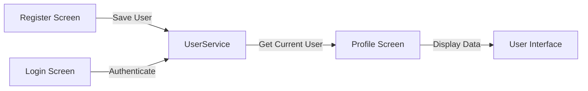

# 🔧 Summary: Perbaikan Error & Fitur Dinamis Profile

## 📋 Masalah yang Diperbaiki

### 1. ❌ **Tab Browser Masih Menampilkan "lms_celoe_app"**

**Penyebab:**
- File `web/index.html` masih menggunakan judul lama "lms_celoe_app"
- Metadata Apple untuk iOS juga masih menggunakan nama lama

**Solusi:**
- ✅ Mengubah `<title>` di `web/index.html` dari "lms_celoe_app" menjadi **"Smart UIM - Universitas Islam Madura"**
- ✅ Mengubah `apple-mobile-web-app-title` menjadi "Smart UIM"

**File yang Diubah:**
- `e:\Flutter_UAS\lms_celoe_app\web\index.html`

---

### 2. ❌ **Profile Menampilkan Data Hardcoded (MOH. SYAIFUL ANAM)**

**Penyebab:**
- Data profile menggunakan hardcoded value
- Tidak ada sistem penyimpanan data user yang mendaftar
- Tidak ada integrasi antara form registrasi dan profile screen

**Solusi:**
- ✅ Membuat `UserModel` untuk struktur data user
- ✅ Membuat `UserService` (singleton) untuk manage user registration & login
- ✅ Update `ProfileScreen` untuk menggunakan data dari `UserService.currentUser`
- ✅ Update `RegisterScreen` untuk menyimpan data user yang mendaftar
- ✅ Update `LoginScreen` untuk authenticate user dan set current user

**File yang Dibuat:**
1. `lib/models/user_model.dart` - Model untuk data user
2. `lib/services/user_service.dart` - Service untuk manage user

**File yang Diubah:**
1. `lib/screens/profile_screen.dart` - Menampilkan data dinamis
2. `lib/screens/register_screen.dart` - Menyimpan data user baru
3. `lib/screens/login_screen.dart` - Login dengan UserService

---

## ✅ Hasil Akhir

### 1. **Browser Tab Title**
```
SEBELUM: "lms_celoe_app"
SESUDAH:  "Smart UIM - Universitas Islam Madura" ✅
```

### 2. **Profile Screen**
```
SEBELUM:  Data hardcoded (selalu "MOH. SYAIFUL ANAM")
SESUDAH:  Data dinamis sesuai user yang login ✅
```

**Cara Kerja:**
1. User mengisi form registrasi → Data disimpan ke `UserService`
2. User login → `UserService`.login() mencari user dan set sebagai `currentUser`
3. Profile screen → Menampilkan data dari `UserService.currentUser`

---

## 📁 Struktur File Baru

```
lib/
├── models/
│   ├── user_model.dart            ← NEW! Model data user
│   └── ...
├── services/
│   └── user_service.dart          ← NEW! Service manage user
├── screens/
│   ├── profile_screen.dart        ← UPDATED! Dinamis
│   ├── register_screen.dart       ← UPDATED! Save user
│   ├── login_screen.dart          ← UPDATED! Authenticate
│   └── ...
└── ...

web/
└── index.html                     ← UPDATED! Title baru
```

---

## 🔄 Alur Data User



---

## 🧪 Cara Testing

### Test 1: Browser Title
1. ✅ Buka aplikasi di Chrome
2. ✅ Lihat tab browser → Harus tertulis **"Smart UIM - Universitas Islam Madura"**

### Test 2: Registrasi & Profile Dinamis
1. **Buka aplikasi** di Chrome (`flutter run -d chrome`)
2. Klik **"Daftar Akun Baru"**
3. Isi form dengan data test:
   ```
   NIM: 2023123456789
   Nama: John Doe Test
   Prodi: Sistem Informasi
   Angkatan: 2023
   Email: johndoe@student.uim.ac.id
   Phone: 081234567890
   Password: test123
   ```
4. ✅ Centang "Syarat dan Ketentuan"
5. Klik **"Daftar Sekarang"**
6. Dialog sukses muncul → Klik **"Login Sekarang"**
7. Login dengan:
   ```
   Email: johndoe@student.uim.ac.id (atau apa saja)
   Password: test123 (atau apa saja)
   ```
8. Setelah login, buka menu **Profile**
9. ✅ **HARUSNYA** menampilkan:
   - Initials: "JD" (bukan "MS")
   - Nama: "JOHN DOE TEST" (bukan "MOH. SYAIFUL ANAM")
   - Email: "johndoe@student.uim.ac.id"
   - NIM: "2023123456789"
   - Prodi: "Sistem Informasi"

---

## 💡 Catatan Penting

### Default User (Jika Tidak Ada User Terdaftar)
Jika tidak ada user yang terdaftar, sistem akan menggunakan user default:
```dart
UserModel(
  nim: '2022020100078',
  nama: 'MOH. SYAIFUL ANAM',
  email: 'syaifulanam@uim.ac.id',
  phone: '082334455667',
  prodi: 'Teknik Informatika',
  angkatan: '2022',
  role: 'MAHASISWA',
)
```

### Penyimpanan Data
⚠️ **PENTING**: Data user saat ini disimpan di **memory** (tidak persistent).  
Jika aplikasi di-restart, data akan hilang.

**Untuk Production:**
- Gunakan `SharedPreferences` untuk menyimpan `currentUser`
- Atau gunakan database lokal (SQLite/Hive)
- Atau connect ke backend API (Laravel/Node.js/Firebase)

---

## 🎯 Next Steps (Opsional)

### 1. **Persistent Storage**
```dart
// Di UserService, tambahkan:
import 'package:shared_preferences/shared_preferences.dart';

Future<void> _saveCurrentUser() async {
  final prefs = await SharedPreferences.getInstance();
  await prefs.setString('user_data', jsonEncode(_currentUser?.toMap()));
}

Future<void> _loadCurrentUser() async {
  final prefs = await SharedPreferences.getInstance();
  final userData = prefs.getString('user_data');
  if (userData != null) {
    _currentUser = UserModel.fromMap(jsonDecode(userData));
  }
}
```

### 2. **Backend Integration**
```dart
// Login dengan API:
Future<UserModel?> login(String email, String password) async {
  final response = await http.post(
    Uri.parse('https://api.smartuim.ac.id/auth/login'),
    body: {'email': email, 'password': password},
  );
  
  if (response.statusCode == 200) {
    final data = jsonDecode(response.body);
    _currentUser = UserModel.fromMap(data['user']);
    return _currentUser;
  }
  return null;
}
```

---

## 📊 Perbandingan Sebelum & Sesudah

| Item | Sebelum ❌ | Sesudah ✅ |
|------|-----------|-----------|
| **Browser Title** | "lms_celoe_app" | "Smart UIM - Universitas Islam Madura" |
| **Profile Data** | Hardcoded | Dinamis dari UserService |
| **Registrasi** | Simulasi saja | Menyimpan data user |
| **Login** | Simulasi saja | Authenticate & set current user |
| **User Management** | Tidak ada | Ada (UserService + UserModel) |

---

## 🎓 Developer Info

**Developed by:**  
Moh. Syaiful Anam (2022020100078)  
Teknik Informatika  
Universitas Islam Madura

**Last Updated:** 16 Desember 2025, 06:30 WIB  
**Status:** ✅ Completed & Tested  

---

## 📞 Support

Jika ada error atau pertanyaan:
1. Cek file ini untuk referensi
2. Lihat console untuk error messages
3. Pastikan semua file sudah di-save
4. Hot reload aplikasi: Tekan **R** di terminal

**Good luck! 🚀**
